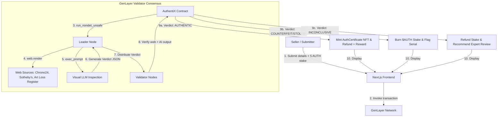
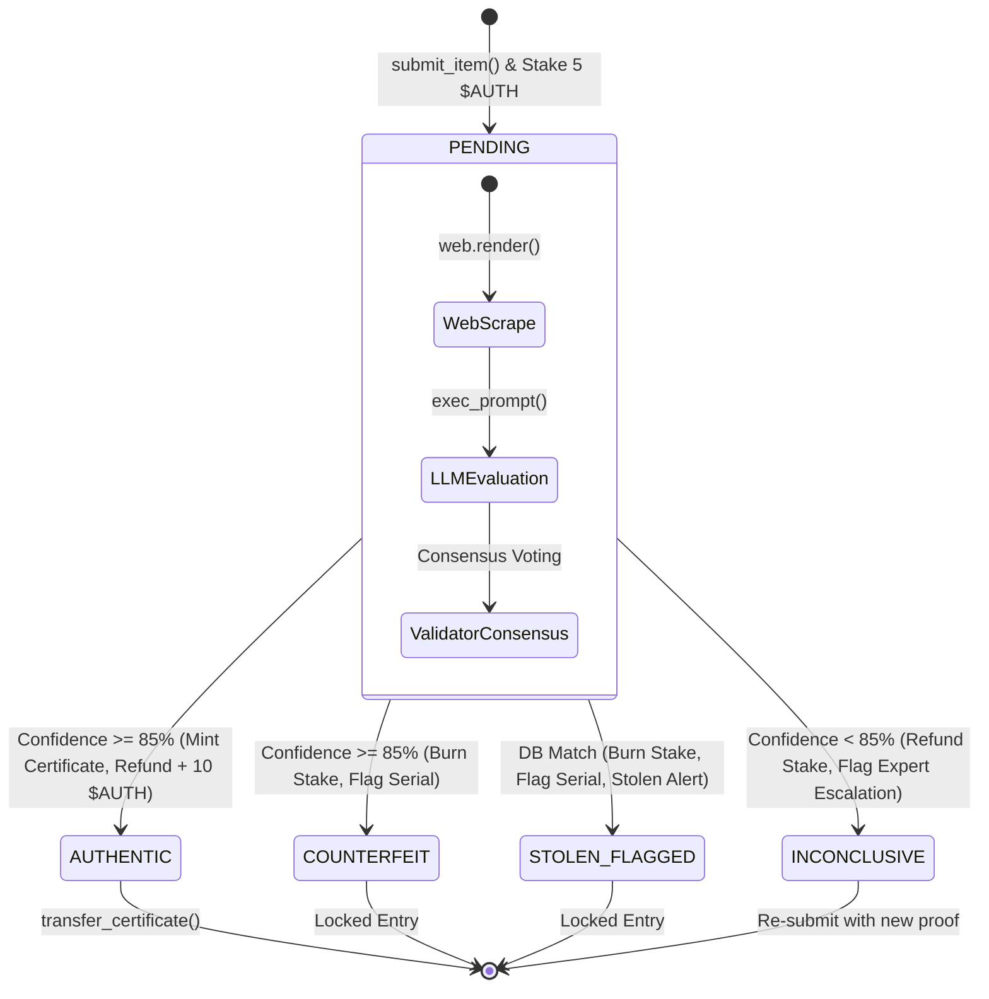
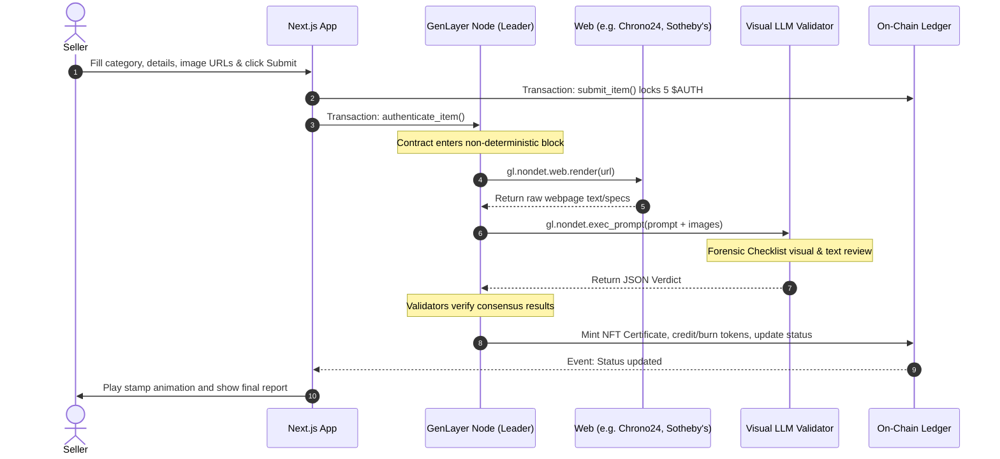

# 🎨 AuthentiX Architecture & Technical Deep Dive

AuthentiX is an AI-powered authentication dApp powered by GenLayer's Intelligent Contracts. This document details the application's components, sequence flows, data structures, and validator checklists.

---

## 🌐 High-Level System Architecture

---

## ⚡ Smart Contract State Transitions

The lifecycle of an item submitted to the AuthentiX protocol transitions through the following states:

---

## 🔄 Sequence Diagram: Authentication Flow

---

## 🧠 Forensic AI Validator Checklists

AuthentiX prompts validators with customized forensic checklists depending on the category:

### 1. Watches (e.g. Rolex, Patek Philippe)
*   **Cyclops Magnification**: Does the date magnifier display at exactly 2.5x with correct font?
*   **Rehaut Laser Alignment**: Are the crown and logo text aligned with the minute ticks?
*   **Bracelet and Clasp**: Are the engravings deep and crisp? Is the metal weight compliant?
*   **Luminescence**: Does ultraviolet light illuminate standard Chromalight/Super-LumiNova colors?

### 2. Fine Art (e.g. Paintings, Drawings)
*   **Brushstroke Signatures**: Are the strokes and pigments consistent with the artist's era and late/early period?
*   **Material Support**: Does the canvas or wood alignment match standard reference sheets?
*   **Refinishing (Refinished Dial)**: Has a paint layer been redone (damaging original features)?
*   **Stolen Cross-Reference**: Does the work match active Interpol and Art Loss lists?

### 3. Handbags (e.g. Hermès Birkin, Chanel)
*   **Saddle Stitching**: Does the stitching show the manual 15-degree slant of hand sewing?
*   **Stitch Density**: Are there exactly 8 stitches per inch (factory standard)?
*   **Logo Foil Stamps**: Does the gold foil text align exactly with the parallel stitching rows?
*   **Palladium Hardware**: Are the weight, screw dimensions, and engraving depths consistent with reference targets?

---

## ⚖️ Why Traditional Web3 Cannot Do This

| Criteria | Ethereum / EVM | Chainlink Oracles | GenLayer (AuthentiX) |
| :--- | :--- | :--- | :--- |
| **Visual Processing** | Impossible (EVM is deterministic only) | No native image support | Yes (`exec_prompt` with image specs) |
| **Subjective Decision Making** | Impossible (Code must compile statically) | No (Oracles only push numeric/exact data) | Yes (consensual agreement on fuzzy logic) |
| **Web Data Scraping** | Impossible (No internet access) | High fee, laggy, multi-party setup | Yes (native `web.render` text mode) |
| **Auditing Cost** | High gas fees | Oracle fees + gas | 5 $AUTH Stake (Earn on Pass) |
